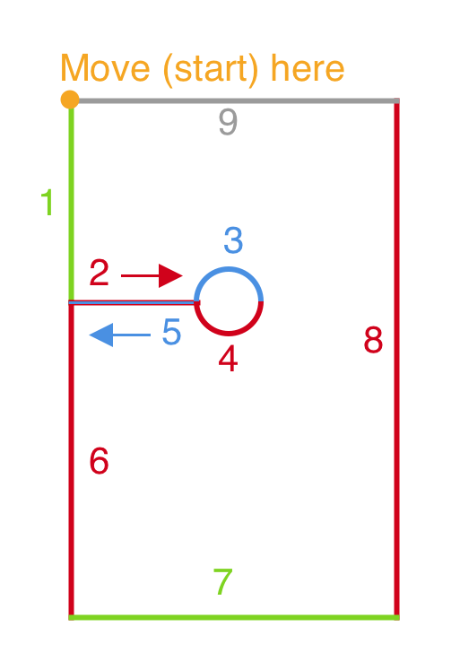

# Tutorial Overlay Mask

The tutorial overlay's SVG is a bit confusing at first, but pretty straight forward once you know what's going on. This was my first time manually drawing an SVG - so I appologize if I didn't do it optimally :) 

The whole SVG is just a series of moves, which are set on the `d` attribute of the `Path`. Each letter corresponds to an action:
- **m(X Y)**: **move to** - this will be our starting point
- **l(X Y)**: draw a **relative line** from our current position to the point (X,Y) away. So if you want a vertical line, your `X = 0`, if you wanted a horizontal line, `Y = 0`. If you wanted a sloped line, set both
- **a**: draw a **relative arc** from the current position. The arc syntax is super confusing, so you can read up more on that if you'd like to. The important part is the `${radius * 2}`. That is where the arc will **end**. The other parameters control it's radius, rotation, "oblongity."

The most confusing part is our circular cut out. I am achieving the circluar effect by drawing two arcs that will **not** be filled in the center. Let's break down the path:

```
<Path
  d={`
    // Move to the top left corner
    M0 0

    // Draw a vertical line down to the center point 
    // of our arc
    l0 ${center.y}

    // Draw a horizontal line to the edge of 
    // our cut out
    l${center.x - radius} 0

    // Draw the **top** arc. It is circular (not 
    // oblong) and will be the length of our circle
    a1,1 0 0,1 ${radius * 2} 0

    // Draw the **bottom** arc. It's doing the same 
    // thing as the above arc, but **starting** where
    // where the first arc ends, and finishing where 
    // the first arc begins.
    a1,1 0 0,1 ${-radius * 2} 0

    // Draw a horizontal line back to where our 
    // vertical line sits
    l${-(center.x - radius)} 0

    // Draw a veritcal line down to the bottom 
    // left corner of the screen
    l0 ${height - center.y}

    // Draw a horizontal line to the bottom 
    // right corner of the screen
    l${width} 0

    // Draw a line to the top right corner 
    // of the screen
    l0 ${-height}

    // At this point, since we did not use the `z` 
    // command, our path will automatically close 
    // itself to the beginning, giving us the desired 
    // effect :) 
  `}
/>
```

Here is an image to help you see the parts:


